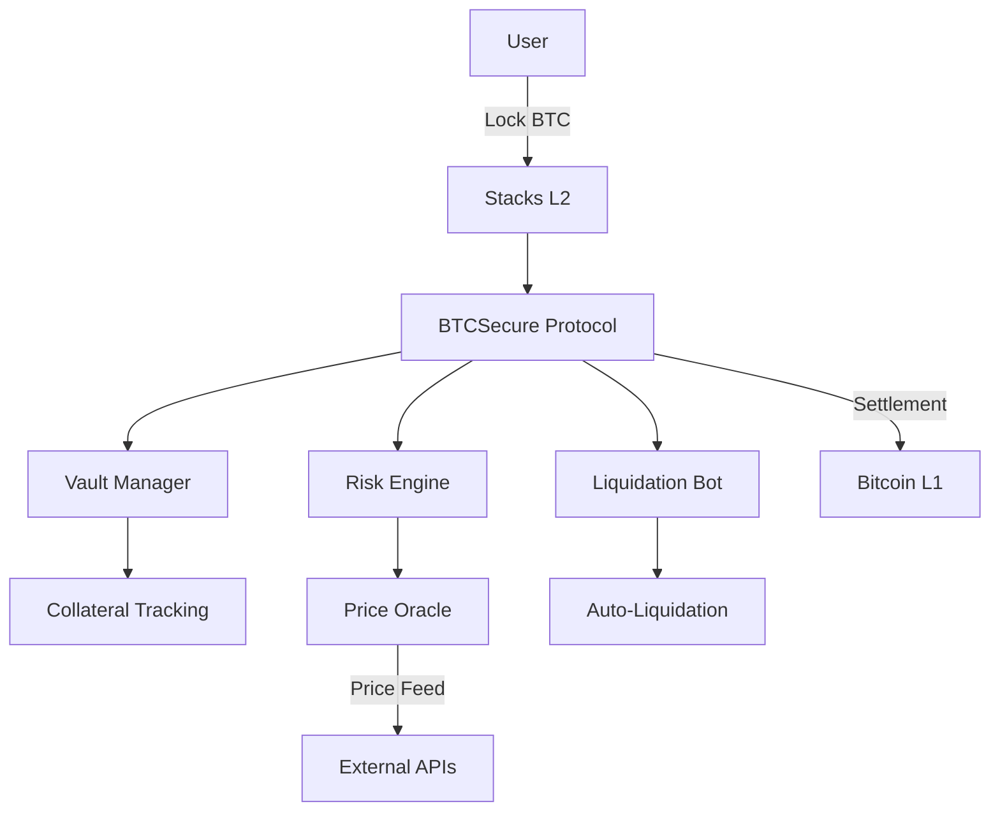
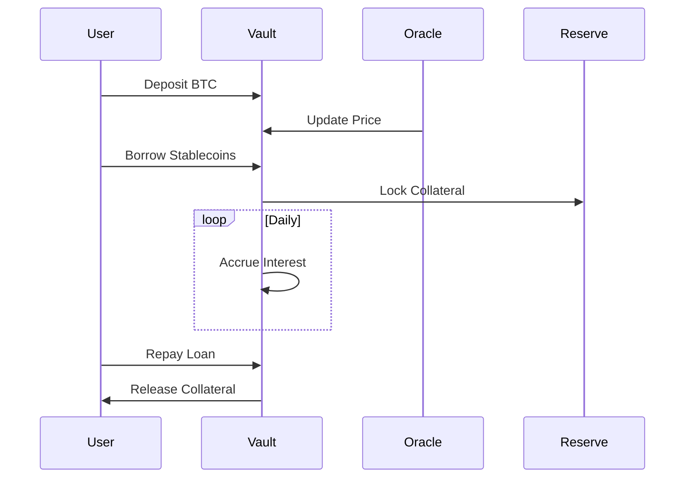
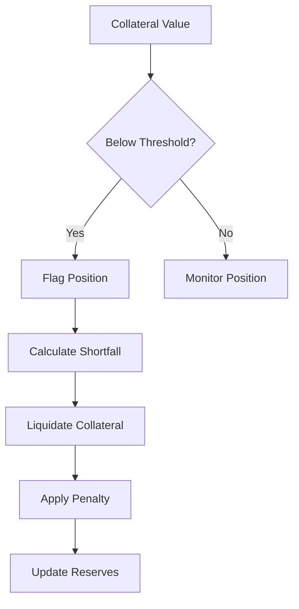

# BTCSecure: Bitcoin-Backed Lending Protocol


A decentralized lending protocol enabling Bitcoin-collateralized loans on the Stacks Layer 2 blockchain. Secure your digital assets while accessing liquidity.

## Overview

BTCSecure revolutionizes decentralized finance by enabling Bitcoin holders to:
- **Secure Loans**: Borrow stablecoins against BTC collateral
- **Maintain Ownership**: Retain BTC exposure while accessing liquidity
- **Benefit from Security**: Leverage Bitcoin's security through Stacks L2

## Key Features

🛡️ **Bitcoin-Centric Design**
- Native BTC collateralization
- Stacks blockchain settlement
- Bitcoin-finalized transactions

📈 **Dynamic Financial Mechanics**
- Risk-adjusted interest rates
- Protocol-managed liquidations
- Collateral health monitoring

🔐 **Institutional-Grade Security**
- Non-custodial architecture
- Time-locked oracle updates
- Multi-layered safety mechanisms

## Architecture Overview



### Core Components

1. **Vault Management**
   - Collateral-to-debt ratio tracking
   - Interest accrual system
   - Multi-asset support

2. **Risk Engine**
   - Real-time collateral valuation
   - Liquidation threshold enforcement
   - Protocol-wide risk monitoring

3. **Oracle System**
   - Decentralized price feeds
   - Validity time windows
   - Emergency price freeze

4. **Liquidation Module**
   - Penalty-based liquidations
   - Partial position closure
   - Incentivized liquidation bots

## Workflow Diagrams

### Loan Lifecycle



### Liquidation Process



## Security Model

### Protection Layers
1. **Collateral Buffers**
   - 150% minimum ratio
   - 125% liquidation threshold

2. **Protocol Safeguards**
   - Emergency pause functionality
   - Governance-controlled parameters
   - Time-locked admin actions

3. **Financial Controls**
   - Interest rate ceilings
   - Liquidation penalty floors
   - Protocol reserve requirements

## Development Setup

### Requirements
- Clarinet 2.0+
- Node.js 18.x
- Bitcoin testnet node
- Stacks testnet access

### Installation
```bash
git clone https://github.com/philip-hue/BTCSecure.git
cd BTCSecure
clarinet check
npm install
```

### Testing Suite
```bash
# Run unit tests
clarinet test --watch

# Start local network
clarinet integrate

# Deploy to testnet
clarinet deploy --testnet
```

## Governance & DAO

BTCSecure features a progressive decentralization roadmap:
1. **Phase 1**: Admin-controlled parameters
2. **Phase 2**: Time-locked governance
3. **Phase 3**: Full DAO control

Governance token holders will eventually control:
- Risk parameters
- Fee structures
- Protocol upgrades
- Treasury management
